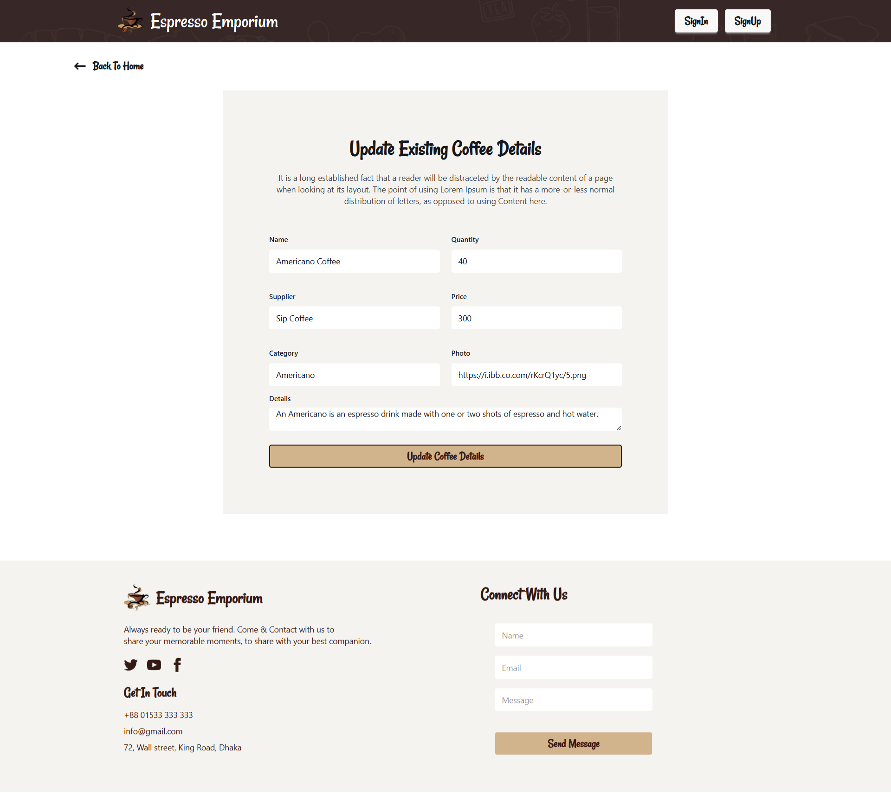
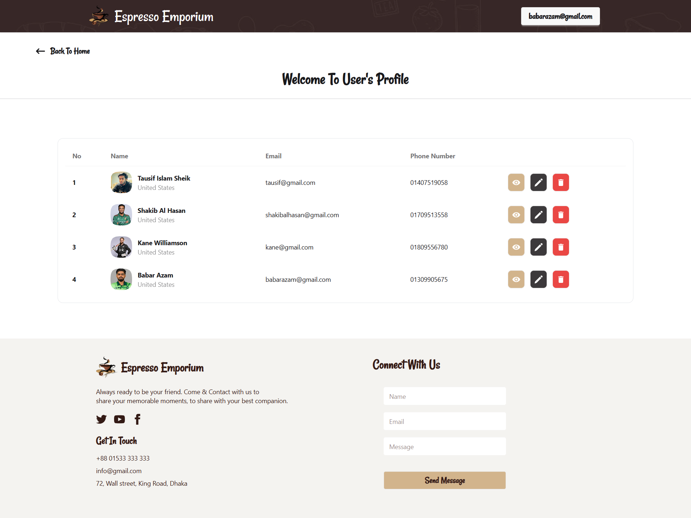

# Espresso Emporium ☕

A modern and responsive web application designed to bring the café experience online.
It showcases a beautifully crafted menu where users can explore different coffee options with ease.
From browsing products to viewing detailed information, the app ensures a smooth and engaging interaction.
Built with a focus on performance, responsiveness, and clean UI, it’s the perfect blend of design and functionality.

## 🚀 Demo

View live: [Espresso Emporium](https://espresso-emporium-a4b34.web.app/)

## 📦 Features

- Responsive design for desktop, tablet, and mobile  
- Dynamic product menu and detail views  
- Admin dashboard for managing menu items  
- Smooth animations and transitions  
- SEO-friendly pages  

## 🧰 Tech Stack

| Layer         | Technologies / Tools     |
|----------------|----------------------------|
| Frontend        | React |
| Styling / UI     | Tailwind CSS |
| State Management | Context API |
| Backend / API     | Node.js + Express / RESTful API |
| Hosting / Deployment | Firebase Hosting / Vercel |

## 📸 Screenshots

.png>)

